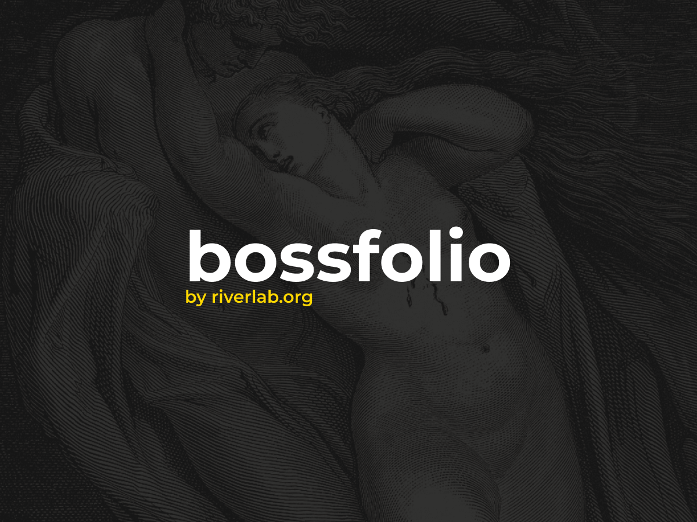

# Bossfolio - O Template para Portfólios em WordPress

## O que é o Bossfolio?

Bossfolio é um elegante e personalizável template WordPress, usado no site [Boss Riverlab](https://boss.riverlab.org). Projetado pela equipe Riverlab, o Bossfolio é a escolha perfeita para criar um portfólio pessoal impressionante e destacar sua disponibilidade para novos projetos.

## Por que escolher o Bossfolio?

O Bossfolio foi criado com a estética e a funcionalidade em mente. Aqui estão algumas razões para escolher este template:

- **Estética Atraente**: O design sofisticado do Bossfolio torna o seu portfólio pessoal visualmente atraente e memorável.

- **Totalmente Personalizável**: Você pode personalizar todos os aspectos do template, desde o fundo até as cores, logo e menu, para atender às suas necessidades individuais.

- **Pronto para Tradução**: Se você deseja criar um site multilíngue, o Bossfolio está pronto para tradução, tornando-o acessível a uma audiência global.

- **Opções Flexíveis**: Com diversas opções de configuração do template, você pode adaptá-lo para se adequar ao seu estilo e conteúdo exclusivos.

## Requisitos e Licença

- **Versão do PHP**: 7.0 ou superior
- **Licença**: Este template é protegido sob a [Licença Pública Geral GNU, versão 3 (GPL v3)](https://www.gnu.org/licenses/gpl-3.0.en.html).

## Como Instalar

1. Faça o download do arquivo ZIP deste repositório.
2. Acesse o painel de administração do seu site WordPress.
3. Vá para "Aparência" e clique em "Temas".
4. Clique em "Adicionar novo" e depois em "Enviar tema".
5. Selecione o arquivo ZIP que você baixou e clique em "Instalar agora".
6. Ative o tema Bossfolio.

Para obter mais informações e suporte, visite [a página do Bossfolio](https://riverlab.org/wordpress/themes/bossfolio).

## Contribuições

Se você deseja contribuir para o desenvolvimento do Bossfolio, fique à vontade para criar um fork deste repositório, fazer as alterações desejadas e enviar um pull request. Agradecemos a sua ajuda!

